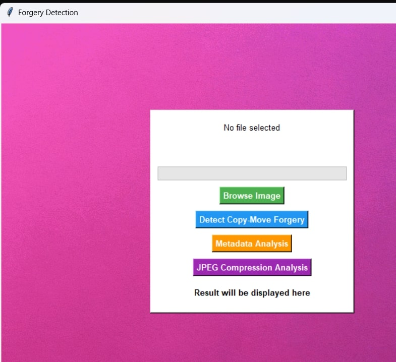
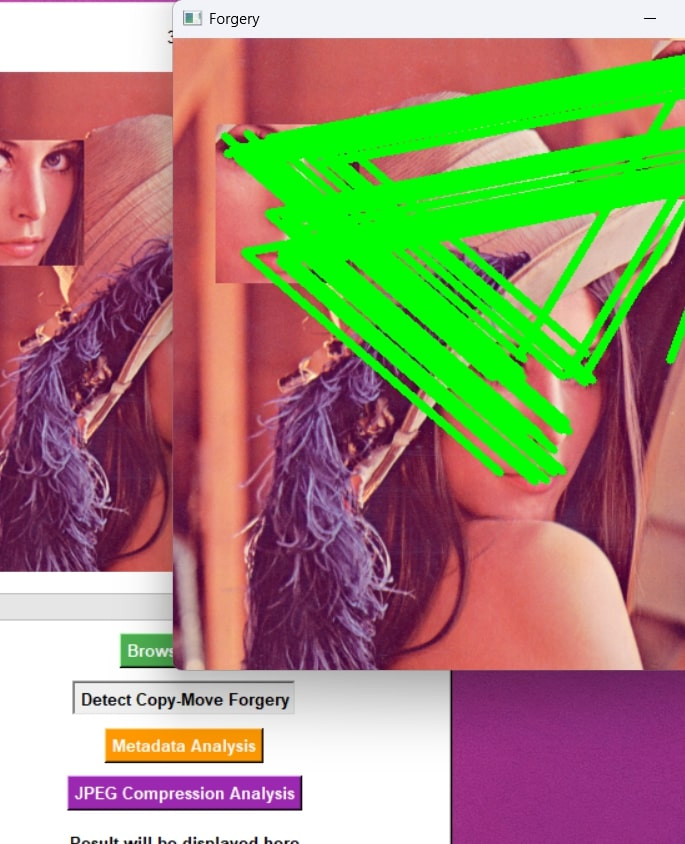
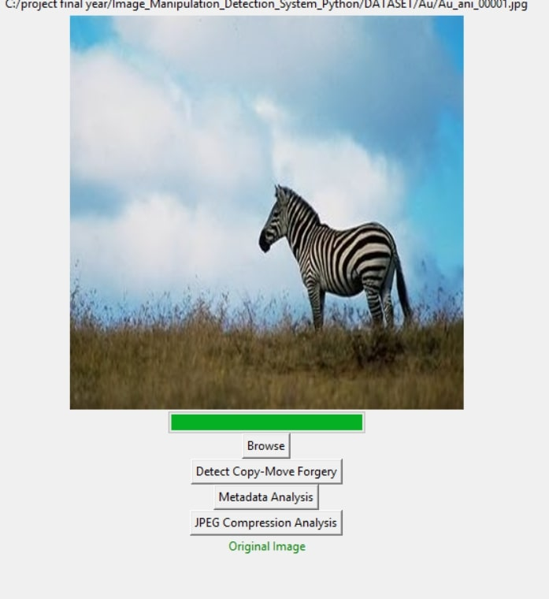
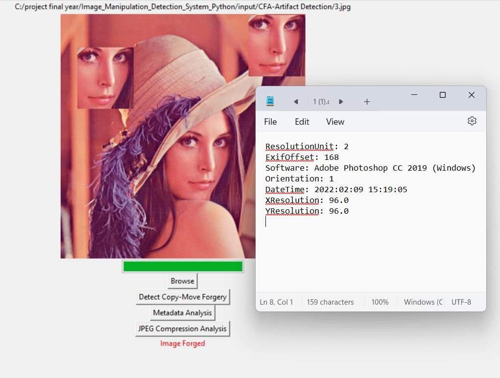

# Image Manipulation (Forgery) Detection System
In today’s technical world, the digital image is a vital part of many application domains. The meaning of image forgery is the manipulation of digital images to hide important information or output false information. Due to the introduction of modern image processing tools, digital image forgery is at its peak. Copy-move forgery is one of the most commonly used techniques to perform image forgery. The aim of the proposed system is to detect and highlight the malpractices performed on modern-day digital images.

# Image Forgery Detection Tool
The forgery detection tool contained in this repository currently features forensic methods to detect the following:

- Double JPEG compression
- Copy-move forgeries
- Metadata Analysis

# Future Scope of the Project: The project can be expanded in several ways:

 	Deep Learning Integration: Implementing deep learning models like CNNs to improve detection accuracy and recognize more sophisticated forgeries.
 	Real-Time Detection: Enhancing the system to analyze images in real- time, making it suitable for surveillance and security applications.
 	Improved Feature Extraction: Using advanced feature extraction techniques to detect subtle modifications more effectively.
 	Multi-Format Support: Expanding the system to support various image formats and resolutions for broader applicability.
 	Mobile and Web Application: Developing a mobile or web-based version to allow easy access and usability across different platforms.


- For More Detail -
 [Research Paper]

 1) https://www.jetir.org/papers/JETIR2312562.pdf

2) https://www.researchgate.net/publication/371957250_IMAGE_FORGERY_DETECTION

3) https://www.mdpi.com/2076-3417/12/6/2851

4) https://bth.diva-portal.org/smash/get/diva2:1643711/FULLTEXT01

5) https://core.ac.uk/download/pdf/229656454.pdf

6) https://www.researchgate.net/publication/Based_Digital_Image_Forgery_Detection_System

7) https://www.ijnrd.org/papers/IJNRD2404235.pdf

8) https://www.ripublication.com/irph/ijert21/ijertv14n5_04.pdf

9) https://www.techscience.com/JCS/v4n2/48755/html

10)https://www.researchgate.net/publication/359153551_Deep_Learning-

11)https://ieeexplore.ieee.org/document/9862034

12)https://journal.ijprse.com/index.php/ijprse/article/view/537/507


## To Run:
<!-- Place any(JPEG) images that you wish to analyze into the **image** folder Present in the Project directory. -->

Navigate to the **Project** directory:
```
$ cd IMG-F-Detection
```

Next, run the **detect.py** script, providing the image you wish to evaluate:
```
$ python GUI.py 


```

Once finished, details on the image will be reported in the terminal. Supplemental images generated during copy-move forgery detection can be found in the output directory.

##  IMAGES




